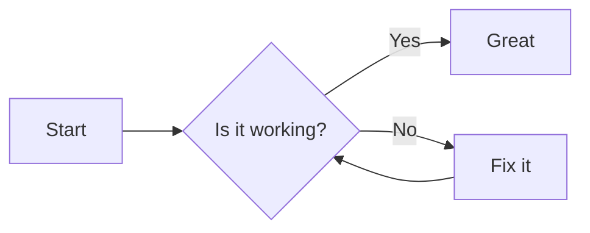
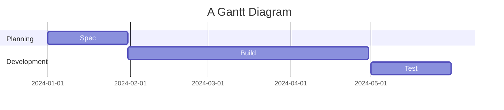

# Example Document

This example demonstrates a Mermaid flowchart and a Gantt chart (Mermaid syntax).

## Flowchart

## Gantt

Regular markdown content, tables, lists, and code blocks are supported.
